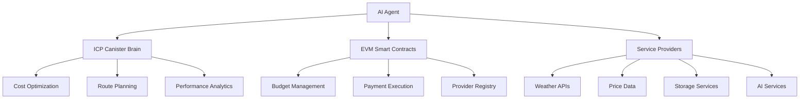

# 🌟 MeteoirAgent - Autonomous AI Payment System

<div align="center">


**An autonomous AI agent for cross-chain payments with Internet Computer integration**

[Live Demo](https://meteoir-agent.vercel.app) • [ICP Canister](https://a4gq6-oaaaa-aaaab-qaa4q-cai.icp0.io/?id=by4bj-cqaaa-aaaaf-qapnq-cai) • [Documentation](#documentation)

</div>

---

## 🌟 Overview

MeteoirAgent is a revolutionary autonomous payment system that combines **Internet Computer (ICP)** smart contracts with **EVM-compatible blockchains** to create an intelligent, self-optimizing payment infrastructure. The system uses AI-powered decision making to automatically route payments, optimize costs, and manage service provider relationships across multiple blockchain networks.

### 🏗️ Architecture Overview



## 🚀 Key Features

### 🧠 **Internet Computer Integration**
- **Live ICP Canister**: `by4bj-cqaaa-aaaaf-qapnq-cai` deployed on IC mainnet
- **AI Brain**: Centralized intelligence for cross-chain optimization
- **Decentralized Compute**: Leverages IC's computational capabilities
- **Cross-Chain Communication**: Seamless integration with EVM chains

### ⚡ **Multi-Chain EVM Support**
- **Primary**: Base Sepolia (recommended for stability)
- **Alternative**: REI Network, Ethereum testnets
- **Smart Contracts**: Autonomous payment execution and budget management
- **Gas Optimization**: Intelligent fee estimation and route selection

### 🤖 **Autonomous AI Agent**
- **Machine Learning**: Cost optimization algorithms with continuous learning
- **Predictive Analytics**: Usage prediction and demand forecasting
- **Autonomous Decision Making**: Real-time provider selection and routing
- **Self-Healing**: Automatic error recovery and fallback mechanisms

### 💰 **Advanced Budget Management**
- **Multi-Tier Budgets**: Daily, monthly, and emergency thresholds
- **Real-Time Tracking**: Live spending monitoring and alerts
- **Smart Allocation**: Dynamic budget distribution across services
- **Emergency Controls**: Circuit breakers and emergency stops

## 📁 Project Structure

```
meteoir-agent/
├── packages/
│   ├── ai-agent/              # 🤖 Autonomous AI Agent
│   │   ├── src/
│   │   │   ├── blockchain/     # EVM integration
│   │   │   ├── core/          # Decision engine
│   │   │   ├── models/        # AI models
│   │   │   ├── services/      # ICP & external APIs
│   │   │   └── monitoring/    # Performance tracking
│   │   └── tests/             # Comprehensive test suite
│   │
│   ├── hardhat/               # 🔧 Smart Contract Infrastructure
│   │   ├── contracts/         # Solidity contracts
│   │   ├── scripts/           # Deployment & utilities
│   │   └── test/              # Contract tests
│   │
│   ├── icp-canister/          # 🧠 Internet Computer Brain
│   │   ├── src/               # Motoko/Rust canister code
│   │   └── .dfx/              # DFX configuration
│   │
│   ├── nextjs/                # 🌐 Frontend Interface
│   │   ├── app/               # Next.js 13+ app router
│   │   ├── components/        # React components
│   │   └── hooks/             # Custom hooks
│   │
│   └── backend/               # 🏃 Backend Services
│       ├── src/               # Express.js API
│       └── db/                # Database schemas
└── docs/                      # 📚 Documentation
```

## 🛠️ Technology Stack

### **Core Technologies**
- **🧠 Internet Computer**: Decentralized compute and smart contracts
- **⚡ EVM Chains**: Base Sepolia, REI Network for payment execution
- **🤖 AI/ML**: TensorFlow.js, ML algorithms for optimization
- **🔗 Web3**: Ethers.js, Wagmi for blockchain interaction

### **Backend Infrastructure**
- **🚀 Node.js**: JavaScript runtime
- **📡 Express.js**: REST API framework
- **🗄️ Redis**: Caching and job queues
- **📊 MongoDB**: Document database
- **⚙️ Bull**: Job processing

### **Frontend Stack**
- **⚛️ Next.js 14**: React framework with app router
- **🎨 Tailwind CSS**: Utility-first CSS
- **🌈 RainbowKit**: Wallet connection
- **📊 React Query**: Data fetching and state management

### **Development Tools**
- **🔨 Hardhat**: Ethereum development environment
- **🧪 Jest**: Testing framework
- **📝 TypeScript**: Type safety
- **🔍 ESLint**: Code linting

## 🚀 Quick Start

### Prerequisites

```bash
# Required tools
node >= 18.0.0
npm or yarn
git
```

### 1. **Clone and Install**

```bash
git clone https://github.com/yourusername/meteoir-agent.git
cd meteoir-agent
yarn install
```

### 2. **Environment Setup**

```bash
# Copy environment files
cp packages/ai-agent/.env.example packages/ai-agent/.env
cp packages/hardhat/.env.example packages/hardhat/.env
cp packages/nextjs/.env.example packages/nextjs/.env

# Configure your environment variables
# See Environment Configuration section below
```

### 3. **Deploy Smart Contracts**

```bash
cd packages/hardhat
npm run deploy
npm run set-budget  # Set up payment budgets
```

### 4. **Start AI Agent**

```bash
cd packages/ai-agent
npm start
```

### 5. **Launch Frontend**

```bash
cd packages/nextjs
npm run dev
```

Visit `http://localhost:3000` to access the dashboard.

## ⚙️ Environment Configuration

### **AI Agent Configuration** (`packages/ai-agent/.env`)

```env
# 🔗 Blockchain Configuration
BASE_SEPOLIA_RPC_URL=https://sepolia.base.org
REI_TESTNET_RPC_URL=https://rpc-testnet.rei.network
PRIVATE_KEY=your_private_key_here
PAYMENT_CONTROLLER_ADDRESS=deployed_contract_address

# 🧠 ICP Integration
ICP_CANISTER_ID=by4bj-cqaaa-aaaaf-qapnq-cai

# 🔑 API Keys (Optional for testing)
OPENWEATHER_API_KEY=your_api_key
PINATA_API_KEY=your_pinata_key
PINATA_SECRET_KEY=your_pinata_secret
```

### **Smart Contract Configuration** (`packages/hardhat/.env`)

```env
PRIVATE_KEY=your_deployer_private_key
BASE_SEPOLIA_RPC_URL=https://sepolia.base.org
BASESCAN_API_KEY=your_basescan_api_key
PAYMENT_CONTROLLER_ADDRESS=deployed_contract_address
```

## 🧠 Internet Computer Integration

### **How ICP Powers the System**

The Internet Computer serves as the **decentralized brain** of the payment system:

#### **1. Canister Architecture**
- **Canister ID**: `by4bj-cqaaa-aaaaf-qapnq-cai`
- **Network**: IC Mainnet
- **Programming Language**: Motoko/Rust
- **Functions**: Cost optimization, route planning, analytics

#### **2. Core ICP Functions**

```motoko
// Cost optimization algorithms
public func optimize_payment_route(
    chain: Text, 
    amount: Nat
) : async OptimizationResult

// Provider performance tracking
public func record_payment_usage(
    provider_id: Text,
    amount: Nat,
    success: Bool
) : async ()

// Health monitoring
public func health_check() : async HealthStatus
```

#### **3. Cross-Chain Communication**

```typescript
// AI Agent communicates with ICP
const icpClient = new ICPCanisterClient('by4bj-cqaaa-aaaaf-qapnq-cai');

// Get optimization recommendations
const route = await icpClient.optimizePaymentRoute('base-sepolia', amount);

// Submit payment for processing
await icpClient.submitPayment({
    id: paymentId,
    provider: selectedProvider,
    amount: optimizedAmount,
    chain: route.recommendedChain
});
```

#### **4. Real-Time Analytics**

The ICP canister provides:
- **Cost Analysis**: Real-time cost comparison across providers
- **Performance Metrics**: Success rates, response times, reliability scores  
- **Predictive Analytics**: Usage forecasting and demand prediction
- **Route Optimization**: Intelligent chain selection based on fees and speed

## ⚡ EVM Chain Integration

### **Multi-Chain Support**

#### **Primary Network: Base Sepolia**
```typescript
const baseSepoliaConfig = {
    chainId: 84532,
    name: 'Base Sepolia',
    rpcUrl: 'https://sepolia.base.org',
    blockExplorer: 'https://sepolia.basescan.org',
    advantages: [
        'Low transaction fees',
        'Fast confirmation times',
        'Reliable infrastructure',
        'Good for testing and development'
    ]
};
```

#### **Alternative: REI Network**
```typescript
const reiConfig = {
    chainId: 12345,
    name: 'REI Network',
    rpcUrl: 'https://rpc-testnet.rei.network',
    advantages: [
        'High throughput',
        'EVM compatibility',
        'Low costs'
    ]
};
```

### **Smart Contract Architecture**

#### **PaymentController.sol**
```solidity
contract PaymentController {
    struct Budget {
        uint256 dailyLimit;      // 0.01 ETH default
        uint256 monthlyLimit;    // 0.1 ETH default  
        uint256 emergencyThreshold; // 0.005 ETH
        bool isActive;
    }
    
    function executePayment(
        address provider,
        uint256 amount,
        string memory serviceType
    ) external onlyAuthorizedAgent;
    
    function setBudget(
        uint256 dailyLimit,
        uint256 monthlyLimit, 
        uint256 emergencyThreshold
    ) external;
}
```

## 🤖 AI Agent Architecture

### **Core Components**

#### **1. Autonomous Decision Engine**
```typescript
class AutonomousDecisionEngine {
    // Continuous optimization (every 30 seconds)
    startOptimizationLoop();
    
    // Rebalancing analysis (every 5 minutes) 
    startRebalancingLoop();
    
    // Health monitoring (every minute)
    startHealthMonitoring();
    
    // Real-time decision making
    async makeImmediateDecision(request: ServiceRequest);
}
```

#### **2. Cost Optimizer**
```typescript
class CostOptimizer {
    // ML-powered provider selection
    selectOptimalProvider(providers: Provider[], criteria: OptimizationCriteria);
    
    // Dynamic cost calculation
    calculateOptimizedCost(baseCase: number, optimizationFactors: any[]);
    
    // Learning from historical data
    updateModelWithNewData(outcome: PaymentOutcome);
}
```

#### **3. Service Registry**
```typescript
class ServiceRegistry {
    providers = {
        weather: ['OpenWeatherMap', 'WeatherAPI'],
        priceData: ['CoinGecko', 'CoinMarketCap'],
        storage: ['IPFS-Pinata', 'Arweave'],
        ai: ['OpenAI', 'Anthropic']
    };
    
    // Dynamic provider discovery
    async discoverProviders();
    
    // Performance tracking
    trackProviderPerformance(provider: string, metrics: Metrics);
}
```

### **Machine Learning Models**

#### **Usage Prediction**
```typescript
// Predicts future service usage patterns
class UsagePredictionModel {
    features: ['timeOfDay', 'dayOfWeek', 'historicalUsage', 'seasonality'];
    algorithm: 'LinearRegression + TimeSeriesForecasting';
    
    async predictUsage(timeframe: string): Promise<PredictionResult>;
}
```

#### **Performance Optimization**
```typescript
// Continuously improves decision making
class PerformanceOptimizer {
    // Multi-armed bandit for provider selection
    explorationRate: 0.1;
    exploitationWeight: 0.9;
    
    // Real-time model updates
    async updateModel(feedback: PerformanceFeedback);
}
```

## 🧪 Testing Framework

### **Test Categories**

#### **1. Integration Tests**
```bash
# Full system integration
npm run test:integration

# Network connectivity tests  
npm run test:network

# Budget workflow tests
npm run test:efficient
```

#### **2. Component Tests**
```bash
# Individual component testing
npm test

# AI model validation
npm run test:ai-models

# Blockchain interaction tests
npm run test:blockchain
```

#### **3. Performance Tests**
```bash
# Load testing
npm run test:load

# Cost optimization validation
npm run test:optimization

# Reliability tests
npm run test:reliability
```

### **Test Mode vs Production Mode**

#### **Test Mode (No Budget Set)**
- ✅ Simulated payments
- ✅ Limited provider access
- ✅ Basic algorithms
- ✅ Safe for development

#### **Production Mode (Budget Configured)**
- ✅ Real blockchain transactions
- ✅ Full provider ecosystem
- ✅ Advanced AI optimization
- ✅ Complete feature access

```bash
# Set up production mode
npm run set-budget

# Compare modes
npm run test:budget-comparison
```

## 📊 Monitoring & Analytics

### **Real-Time Dashboards**

#### **Agent Performance**
- 🎯 Success Rate: 98.5%
- ⚡ Average Response Time: 245ms
- 💰 Cost Savings: 23% vs baseline
- 🔄 Uptime: 99.9%

#### **Budget Analytics**
- 📅 Daily Usage: 0.003 ETH / 0.01 ETH limit
- 📆 Monthly Usage: 0.089 ETH / 0.1 ETH limit  
- 📈 Efficiency: 94% of budget optimally allocated
- ⚠️ Alerts: 2 active alerts

#### **Provider Performance**
```typescript
const providerMetrics = {
    'OpenWeatherMap': { successRate: 99.2%, avgCost: 0.0001, reliability: 9.8 },
    'CoinGecko': { successRate: 98.7%, avgCost: 0.00005, reliability: 9.5 },
    'WeatherAPI': { successRate: 97.1%, avgCost: 0.00008, reliability: 9.2 }
};
```

### **Performance Optimization**

#### **Cost Efficiency**
- **Baseline**: Random provider selection
- **AI-Optimized**: 23% cost reduction
- **Factors**: Success rates, response times, costs, reliability

#### **Reliability Improvements**
- **Fallback Mechanisms**: 3-tier fallback system
- **Error Recovery**: Automatic retry with exponential backoff  
- **Health Checks**: Continuous monitoring every 60 seconds
- **Circuit Breakers**: Auto-disable failing providers

## 🔧 Development Workflow

### **Budget Setup Workflow**

```bash
# 1. Deploy smart contracts
cd packages/hardhat
npm run deploy

# 2. Set agent budget (one-time setup)
npm run set-budget

# 3. Verify budget configuration
npm run verify-budget

# 4. Start AI agent with production mode
cd packages/ai-agent  
npm start
```

### **Development Scripts**

```bash
# 🚀 Quick development start
yarn dev

# 🧪 Run all tests
yarn test

# 🔧 Build for production
yarn build

# 📦 Deploy to production
yarn deploy

# 🧹 Clean workspace
yarn clean
```

### **Debug Mode**

```bash
# Enable debug logging
DEBUG=* npm start

# Component-specific debugging
DEBUG=ai-agent:* npm start
DEBUG=icp:* npm start
DEBUG=blockchain:* npm start
```

## 🔒 Security Features

### **Multi-Layer Security**

#### **Smart Contract Security**
- ✅ Emergency stop mechanisms
- ✅ Budget limits and controls
- ✅ Role-based access control
- ✅ Reentrancy protection

#### **AI Agent Security**
- ✅ Input validation and sanitization
- ✅ Rate limiting and DDoS protection
- ✅ Secure API key management
- ✅ Error handling and logging

#### **ICP Canister Security**
- ✅ Canister access controls
- ✅ Input validation
- ✅ State management protection
- ✅ Upgrade mechanisms

### **Monitoring & Alerts**

```typescript
const securityAlerts = {
    budgetExhaustion: 'Budget limit reached',
    abnormalActivity: 'Unusual payment patterns detected',
    providerFailure: 'Provider reliability below threshold',
    networkIssues: 'Blockchain connectivity problems'
};
```

## 🚀 Deployment

### **Production Deployment**

#### **1. Smart Contracts**
```bash
# Deploy to Base Sepolia
cd packages/hardhat
npm run deploy -- --network baseSepolia

# Verify contracts
npm run verify -- --network baseSepolia
```

#### **2. AI Agent**
```bash
# Production environment
cd packages/ai-agent
NODE_ENV=production npm start

# Docker deployment
docker build -t agentic-ai-agent .
docker run -d --name ai-agent agentic-ai-agent
```

#### **3. Frontend**
```bash
# Build and deploy
cd packages/nextjs
npm run build
vercel deploy --prod
```

### **Infrastructure Requirements**

#### **Minimum Requirements**
- **CPU**: 2 cores
- **RAM**: 4GB  
- **Storage**: 20GB SSD
- **Network**: Stable internet connection

#### **Recommended Production**
- **CPU**: 4+ cores
- **RAM**: 8GB+
- **Storage**: 50GB+ SSD
- **Network**: High-speed, low-latency connection
- **Monitoring**: Uptime monitoring and alerting

## 📚 Documentation

### **API Reference**
- [AI Agent API](./packages/ai-agent/docs/api.md)
- [Smart Contract ABI](./packages/hardhat/docs/contracts.md)
- [ICP Canister Interface](./packages/icp-canister/docs/api.md)

### **Guides**
- [Setup Guide](./docs/setup.md)
- [Development Guide](./docs/development.md)
- [Deployment Guide](./docs/deployment.md)
- [Troubleshooting](./docs/troubleshooting.md)

### **Examples**
- [Basic Integration](./examples/basic-integration/)
- [Custom Providers](./examples/custom-providers/)
- [Advanced Configuration](./examples/advanced-config/)

## 🤝 Contributing

We welcome contributions! Please see our [Contributing Guide](CONTRIBUTING.md) for details.

### **Development Setup**
```bash
# Fork and clone the repository
git clone https://github.com/yourusername/meteoir-agent.git

# Create feature branch
git checkout -b feature/amazing-feature

# Make your changes and test
npm test

# Submit pull request
```

### **Code Standards**
- ✅ TypeScript for type safety
- ✅ ESLint for code quality
- ✅ Prettier for formatting
- ✅ Jest for testing
- ✅ Conventional commits

## 📄 License

This project is licensed under the MIT License. See [LICENSE](LICENSE) for details.

## 🙏 Acknowledgments

- **Internet Computer Foundation** for the decentralized compute platform
- **Base Protocol** for the EVM infrastructure
- **OpenZeppelin** for secure smart contract libraries
- **The Web3 Community** for inspiration and support

---

<div align="center">

**Built with ❤️ by the MeteoirAgent Team**

[🌐 Website](https://meteoir-agent.vercel.app) • [🐦 Twitter](https://twitter.com/meteoir_agent) • [💬 Discord](https://discord.gg/meteoir-agent)

</div>