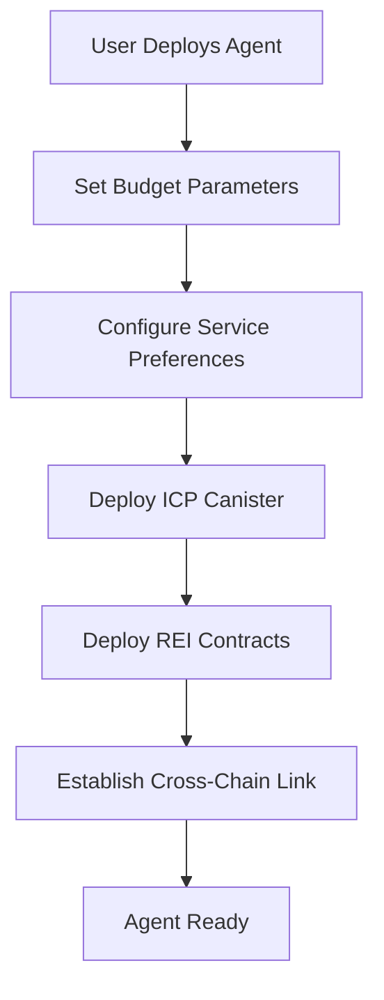
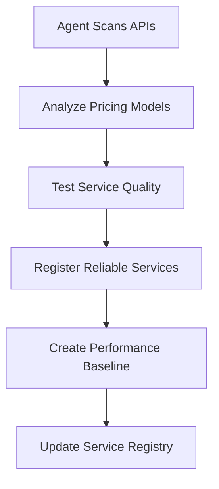
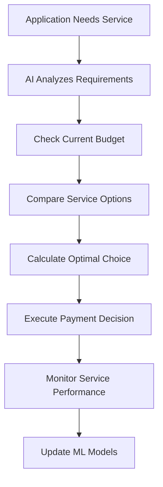
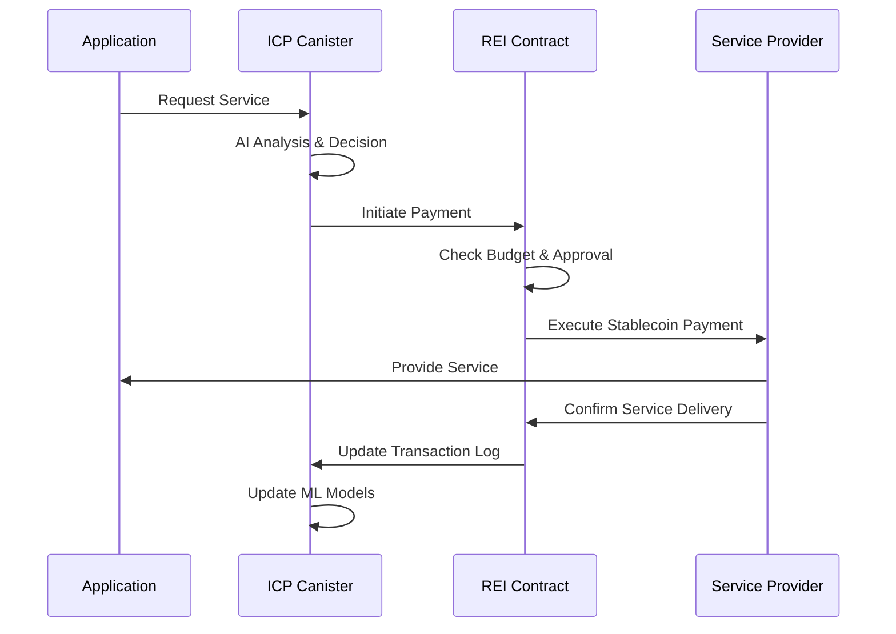
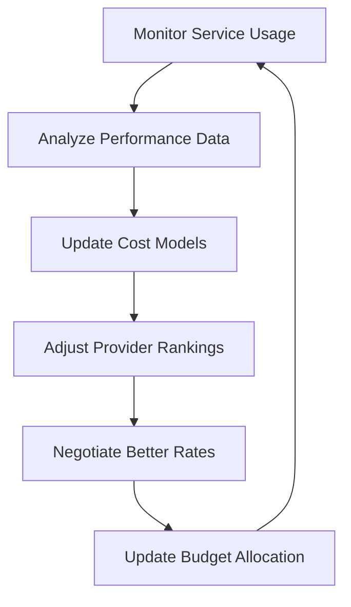

# Autonomous AI Agent for Stablecoin Payments

## 🎯 Project Overview

An autonomous AI agent that intelligently manages and executes stablecoin payments for services (APIs, cloud, subscriptions) across multiple blockchains without human intervention. The agent combines REI Network's zero-fee transactions with ICP's on-chain AI capabilities to create the first truly autonomous cross-chain payment system.

## 🏗 System Architecture

### Multi-Chain Design
```
┌─────────────────────────────────────────────────────────────────┐
│                    Autonomous Payment Agent                     │
├─────────────────┬─────────────────┬─────────────────────────────┤
│   ICP Canister  │  REI Network    │      External World         │
│   (AI Brain)    │  (Payment Hub)  │     (Services & APIs)       │
│                 │                 │                             │
│ • AI Models     │ • Smart         │ • Cloud APIs (AWS, GCP)    │
│ • Decision      │   Contracts     │ • Data Feeds (Weather,     │
│   Engine        │ • Payment       │   Finance, ML)              │
│ • HTTP Outcalls │   Execution     │ • Storage Services (IPFS,  │
│ • Frontend      │ • Service       │   Arweave)                  │
│ • Data Storage  │   Registry      │ • Compute Services          │
│ • User Config   │ • Budget Mgmt   │ • Subscription Services     │
└─────────────────┴─────────────────┴─────────────────────────────┘
```

### Core Components

#### 1. AI Decision Engine (ICP Canister)
- **Cost Optimization Algorithm**: Analyzes service pricing and quality metrics
- **Usage Prediction Model**: Forecasts resource needs based on historical data
- **Negotiation Logic**: Automatically switches between service providers
- **Risk Assessment**: Monitors service reliability and adjusts strategies

#### 2. Payment Execution Layer (REI Network)
- **Smart Payment Controller**: Manages budgets and approval thresholds
- **Service Provider Registry**: Maintains database of available APIs/services
- **Multi-Token Support**: Handles USDC, USDT, and other stablecoins
- **Transaction Logging**: Records all payments for auditing

#### 3. Cross-Chain Bridge
- **Chain Fusion Integration**: Native ICP ↔ REI Network communication
- **Asset Management**: Handles token transfers between chains
- **State Synchronization**: Keeps both chains updated on agent status

## 🔄 Workflow Specification

### 1. Initialization Phase


**Actions:**
- User sets daily/monthly budgets and approval thresholds
- Configures preferred service types and quality requirements
- Agent deploys across both ICP and REI Network
- Cross-chain communication channels established

### 2. Service Discovery & Registration


**AI Logic:**
- Continuously discovers new APIs and services
- Tests response times, uptime, and data quality
- Builds reputation scores for each service provider
- Maintains dynamic pricing database

### 3. Autonomous Decision Making


**Decision Factors:**
- **Cost**: Current pricing vs. budget constraints
- **Quality**: Historical performance and reliability scores
- **Speed**: Response time requirements
- **Availability**: Current service status
- **Contracts**: Existing subscriptions vs. pay-per-use

### 4. Payment Execution Workflow


### 5. Continuous Optimization Loop


## 🛠 Technical Implementation

### Smart Contract Architecture

#### ICP Canister (Rust/Motoko)
```rust
// Pseudo-code structure
struct AutonomousAgent {
    decision_engine: AIModel,
    service_database: ServiceRegistry,
    performance_metrics: HashMap<ServiceId, Metrics>,
    user_preferences: UserConfig,
}

impl AutonomousAgent {
    fn analyze_service_need(&self, request: ServiceRequest) -> Decision;
    fn optimize_costs(&self, options: Vec<ServiceOption>) -> ServiceOption;
    fn execute_cross_chain_payment(&self, payment: PaymentRequest);
    fn update_models(&mut self, feedback: ServiceFeedback);
}
```

#### REI Network Contracts (Solidity)
```solidity
contract PaymentController {
    mapping(address => Budget) public budgets;
    mapping(address => ServiceProvider) public providers;
    
    struct Budget {
        uint256 dailyLimit;
        uint256 monthlyLimit;
        uint256 currentSpent;
        uint256 approvalThreshold;
    }
    
    function executePayment(
        address provider,
        uint256 amount,
        bytes calldata serviceData
    ) external onlyAuthorizedAgent;
    
    function addServiceProvider(
        address provider,
        string memory apiEndpoint,
        uint256 costPerCall
    ) external;
}
```

### AI Model Components

#### 1. Cost Optimization Model
- **Input**: Service requirements, current pricing, historical performance
- **Output**: Ranked list of optimal service providers
- **Algorithm**: Multi-objective optimization with cost, quality, and reliability weights

#### 2. Usage Prediction Model
- **Input**: Historical usage patterns, time of day, application type
- **Output**: Predicted resource needs for next 24 hours
- **Algorithm**: Time series forecasting with seasonal adjustments

#### 3. Negotiation Strategy Model
- **Input**: Service provider behavior, market conditions, usage volume
- **Output**: Optimal negotiation tactics and pricing thresholds
- **Algorithm**: Game theory-based approach with reinforcement learning

### API Integration Framework

#### Service Adapter Pattern
```javascript
class ServiceAdapter {
    constructor(provider, pricing, authentication) {
        this.provider = provider;
        this.pricing = pricing;
        this.auth = authentication;
    }
    
    async callService(data) {
        // Execute payment
        await this.paymentController.executePayment(
            this.provider.address,
            this.calculateCost(data),
            data
        );
        
        // Make API call
        return await this.provider.api.call(data);
    }
}
```

## 🎮 Demo Scenarios

### Scenario 1: Weather Data Optimization
1. **Context**: DeFi protocol needs weather data for crop insurance
2. **Agent Action**: Compares 3 weather APIs, selects cheapest reliable option
3. **Payment**: Executes micro-payment for single data point
4. **Optimization**: Switches to bulk subscription when usage increases

### Scenario 2: Cloud Storage Arbitrage
1. **Context**: Application needs to store user data
2. **Agent Action**: Analyzes AWS vs IPFS vs Arweave pricing
3. **Payment**: Pays for storage based on data size and retrieval frequency
4. **Optimization**: Migrates data between services based on access patterns

### Scenario 3: Compute Resource Scaling
1. **Context**: ML model needs training compute
2. **Agent Action**: Discovers GPU rental services, compares hourly rates
3. **Payment**: Executes payment for compute hours
4. **Optimization**: Terminates early if results converge, saves costs

### Scenario 4: Emergency Budget Management
1. **Context**: Daily budget nearly exhausted
2. **Agent Action**: Downgrades to cheaper services, postpones non-critical tasks
3. **Payment**: Maintains essential services within budget constraints
4. **Optimization**: Requests budget increase or waits for next period

## 📊 Key Metrics & Analytics

### Performance Indicators
- **Cost Savings**: % reduction compared to manual service selection
- **Service Uptime**: Availability of chosen services vs alternatives
- **Response Time**: Average latency of service calls
- **Budget Utilization**: Efficiency of spending vs allocated budgets

### Real-time Monitoring
- **Transaction Volume**: Number of autonomous payments per hour
- **Service Provider Health**: Uptime and performance of integrated APIs
- **Cross-Chain Latency**: Time for ICP ↔ REI communication
- **AI Model Accuracy**: Prediction accuracy vs actual usage

## 🔒 Security & Risk Management

### Security Measures
- **Multi-signature Wallets**: Require multiple approvals for large payments
- **Rate Limiting**: Prevent runaway spending through transaction limits
- **Service Validation**: Verify service delivery before marking payments complete
- **Emergency Stops**: Manual override capability for critical situations

### Risk Mitigation
- **Diversification**: Never depend on single service provider
- **Gradual Rollout**: Start with small budgets, increase based on performance
- **Audit Trail**: Comprehensive logging of all decisions and payments
- **Fallback Services**: Always maintain backup service providers

## 🚀 Deployment Strategy

### Development Phases
1. **MVP (24 hours)**: Basic payment automation with 2-3 service integrations
2. **Alpha**: Enhanced AI models and 10+ service providers
3. **Beta**: Cross-chain optimization and advanced negotiation features
4. **Production**: Enterprise features and institutional support

### Scaling Plan
- **Horizontal**: Add more blockchain networks (Ethereum, Polygon, etc.)
- **Vertical**: Support more service categories (identity, oracles, governance)
- **Geographic**: Region-specific service providers and compliance
- **Industry**: Specialized agents for DeFi, gaming, IoT, enterprise

## 🎯 Business Model & Sustainability

### Revenue Streams
1. **Service Fees**: Small percentage of managed payment volume
2. **Premium Features**: Advanced AI models and priority support
3. **Enterprise Licensing**: Custom deployment for large organizations
4. **Data Insights**: Anonymized market intelligence for service providers

### Value Proposition
- **For Users**: Reduced costs, improved efficiency, 24/7 automation
- **For Service Providers**: Increased usage, automatic payments, market insights
- **For Ecosystem**: Enables true machine-to-machine commerce at scale

---

## 📋 Implementation Checklist

### Core Infrastructure
- [ ] ICP canister deployment with AI models
- [ ] REI Network smart contracts for payment logic
- [ ] Cross-chain communication bridge
- [ ] Service provider registry system

### AI Components
- [ ] Cost optimization algorithm
- [ ] Usage prediction model
- [ ] Service quality assessment
- [ ] Automated negotiation logic

### Integrations
- [ ] Weather API integration (OpenWeatherMap)
- [ ] Cloud storage integration (AWS S3, IPFS)
- [ ] Compute services integration (serverless functions)
- [ ] Data feed integration (price oracles)

### Frontend & Monitoring
- [ ] User dashboard for configuration
- [ ] Real-time payment monitoring
- [ ] Analytics and reporting
- [ ] Mobile-responsive design

### Security & Testing
- [ ] Smart contract audits
- [ ] AI model validation
- [ ] Cross-chain testing
- [ ] Load testing with high transaction volume

This autonomous payment agent represents the future of machine-to-machine commerce, combining cutting-edge AI with multi-chain blockchain infrastructure to create truly intelligent financial automation.